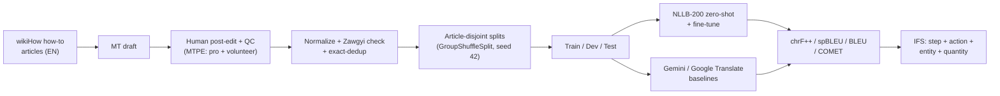

# WikiHow-MY

**A human post-edited English→Myanmar instructional MT corpus, an NLLB-200 benchmark, and the Instruction Faithfulness Score (IFS).**


Burmese (Myanmar) is a low-resource language, and the procedural text people
actually need translated — _how-to_ instructions — is exactly where generic MT
breaks down: a dropped step, a swapped quantity, or a mistranslated entity can
make an instruction wrong rather than merely awkward. WikiHow-MY is a corpus,
benchmark, and metric built to study that problem head-on.

> **Honesty note.** This corpus is **human post-edited machine translation
> (MTPE)** — machine drafts that were edited and quality-checked by people
> (a paid professional translation service plus volunteer editors). It is
> _not_ presented as gold-standard from-scratch human translation, and the
> paper frames it as such.

---

## Three contributions

1. **A ~10K-pair en→my WikiHow instructional corpus** with **article-disjoint**
   train/dev/test splits — no how-to article spans two splits, so the benchmark
   measures generalization to _unseen instructions_, not memorization.
2. **An NLLB-200 benchmark** (zero-shot and fine-tuned) with chrF++ as the
   primary metric, alongside spBLEU and BLEU, plus LLM and Google Translate
   baselines.
3. **The Instruction Faithfulness Score (IFS)** — an evaluation metric centered
   on whether a translation preserves the **step + action** of an instruction
   (with entity and quantity preservation as adopted components), validated
   against human followability judgements.

## Pipeline



## Dataset at a glance

|                                   |                                          |
| --------------------------------- | ---------------------------------------- |
| Aligned pairs (after exact-dedup) | **10,056**                               |
| Distinct how-to articles          | **82**                                   |
| Train / Dev / Test (pairs)        | **8,302 / 908 / 846**                    |
| Train / Dev / Test (articles)     | **66 / 8 / 9**                           |
| Article overlap between splits    | **0** (asserted in code)                 |
| Median pairs per article          | 116                                      |
| Mean English length               | 14.3 whitespace tokens                   |
| Mean Myanmar length               | 93.0 characters (Myanmar is unsegmented) |
| Zawgyi-suspect rows               | **0** (clean Unicode)                    |

Myanmar has no orthographic word boundaries, so length is reported in
characters and metric choice favors segmentation-agnostic chrF++ over BLEU.

## Why article-disjoint splits matter

An earlier version of this project split the data at the **sentence level with
no fixed seed**, which leaked sentences from the same article across train and
test — inflating every score and making the benchmark meaningless. The current
splits group by `article_id` and assert zero article overlap. The full finding
is written up in [`docs/data-audit.md`](docs/data-audit.md); the fix lives in
[`src/data/build_splits.py`](src/data/build_splits.py) and reproduces
bit-for-bit with `seed=42`.

## Results (test set, n=846)

English→Myanmar. chrF++ is the primary metric (segmentation-agnostic for
unsegmented Burmese); MetricX-24 is an error score where **lower is better**.

| System                               |    chrF++ |    spBLEU |     BLEU |     COMET | MetricX-24 ↓ |   IFS |
| ------------------------------------ | --------: | --------: | -------: | --------: | -----------: | ----: |
| NLLB-200-distilled-600M (zero-shot)  |     36.01 |     19.33 |     2.62 |     0.858 |         4.09 | 94.11 |
| NLLB-200-distilled-600M (fine-tuned) |     41.64 |     23.18 |     3.74 |     0.886 |         3.23 | 95.79 |
| Gemini 2.5 Flash (5-shot)            |     42.59 |     24.77 |     3.47 | **0.904** |     **2.39** | 94.33 |
| Google Translate                     | **43.60** | **27.65** | **5.07** |     0.894 |         2.71 | 95.27 |

**Key finding — metrics disagree on the winner.** Surface metrics
(chrF++/spBLEU/BLEU) rank Google Translate first, while **both** learned metrics
(COMET and MetricX-24) rank Gemini first. This surface-vs-semantic split
reproduces on independent FLORES+ references, so it is a property of the metrics,
not an artifact of our post-edited corpus. Fine-tuning NLLB improves **every**
metric (+5.6 chrF++ in-domain) and also lifts out-of-domain FLORES+ (+4.3 chrF++)
— domain adaptation with no catastrophic forgetting.

**Decoding-time reranking probe (negative result).** A reference-optimal pick
from the fine-tuned model's 16-best beats Google Translate (oracle 46.27 > 43.60
chrF++), but no reference-free selector — COMET-Kiwi QE, structural IFS, fused, or
MBR — recovers it (best +0.4). COMET-Kiwi's per-source ranking correlates only
ρ=0.10 with reference chrF++: learned-QE miscalibration for Burmese, made concrete
at decoding time. Details in [`docs/rerank-booster.md`](docs/rerank-booster.md).

Tables are generated from `experiments/results/*.json` by
`src/eval/make_tables.py` — numbers are never hand-typed into the paper.

## Pretrained model

The fine-tuned model is published on the Hugging Face Hub:
**[`PyaeSoneK/nllb-600m-wikihow-en-my`](https://huggingface.co/PyaeSoneK/nllb-600m-wikihow-en-my)**
(CC-BY-NC-4.0, inherited from NLLB-200).

```python
from transformers import AutoModelForSeq2SeqLM, AutoTokenizer

mid = "PyaeSoneK/nllb-600m-wikihow-en-my"
tok = AutoTokenizer.from_pretrained(mid, src_lang="eng_Latn")
model = AutoModelForSeq2SeqLM.from_pretrained(mid)
enc = tok("Fold the paper in half, then crease the edge firmly.", return_tensors="pt")
out = model.generate(**enc, forced_bos_token_id=tok.convert_tokens_to_ids("mya_Mymr"),
                     num_beams=5, max_new_tokens=256)
print(tok.batch_decode(out, skip_special_tokens=True)[0])
```

## Project structure

```
wikihow-mt-my/
├── data/
│   ├── raw/         # source CSV + per-article text (gitignored — see Data & licensing)
│   ├── processed/   # train/dev/test .jsonl (gitignored); stats JSONs are tracked
│   └── sample/      # 20-row committed teaser
├── src/
│   ├── data/        # build_splits.py, normalize.py, stats.py
│   ├── infer/       # translate.py, translate_nbest.py, llm_baselines.py
│   ├── train/       # finetune_nllb.py + config.yaml
│   ├── rerank/      # rerank.py, score_qe.py  (IFS+QE decoding-time booster)
│   └── eval/        # automatic.py, ifs.py, correlate.py, make_tables.py
├── scripts/         # Kaggle GPU orchestrators, COMET/MetricX, push_to_hub.py
├── notebooks/       # colab_finetune_nllb.ipynb  (GPU training)
├── experiments/     # LOG.md (append-only) + results/
├── paper/           # main.tex, references.bib, MODEL_CARD.md, tables/, figures/
└── docs/            # execution-plan.md, data-audit.md, rerank-booster.md, ...
```

## Getting started

```bash
# 1. install
python -m venv .venv && . .venv/bin/activate      # Windows: .venv\Scripts\activate
pip install -r requirements.txt

# 2. rebuild the splits from source (needs data/raw/ — see Data & licensing)
python src/data/build_splits.py        # writes data/processed/*.jsonl, seed 42
python src/data/stats.py               # writes stats JSON + paper/figures/

# 3. zero-shot baseline (CPU works for a smoke test; GPU for the full run)
python src/infer/translate.py --split test --system nllb_zeroshot --limit 20
python src/eval/automatic.py \
    --hyps experiments/results/nllb_zeroshot_test_hyps.txt \
    --refs data/processed/test.jsonl --system nllb_zeroshot --limit 20

# 4. fine-tune on a GPU — run notebooks/colab_finetune_nllb.ipynb on Colab
```

## Data & licensing

The **code** is licensed under **Apache-2.0** (`LICENSE`). The **corpus** is
licensed under **CC BY-NC-SA 3.0** (`LICENSE-DATA`), inherited from wikiHow's
source license.

To respect that license, this repository does **not** redistribute the English
wikiHow text. The corpus is released by **rehydration** — the Myanmar
translations, the source article identifiers, and the build script are
published so the aligned pairs can be reconstructed locally; the raw and
processed parallel files are gitignored. A 20-row sample lives in
`data/sample/` for inspection. See `LICENSE-DATA` for full attribution.

## Status

Work in progress, targeting the **WMT 2026** research track. **Done:** corpus
cleaning, article-disjoint splits, dataset statistics, the evaluation harness,
the full benchmark (NLLB zero-shot + fine-tuned, Gemini 2.5 Flash, Google
Translate) on chrF++/spBLEU/BLEU/COMET/MetricX-24, the FLORES+ out-of-domain
bias control, the automatic IFS components, the decoding-time reranking probe,
and the published fine-tuned model. **Next:** the IFS human-followability study
(the keystone validation). Methodology and the running plan are in
[`docs/execution-plan.md`](docs/execution-plan.md).

## License & author

- Code: Apache-2.0 — see [`LICENSE`](LICENSE)
- Data: CC BY-NC-SA 3.0 — see [`LICENSE-DATA`](LICENSE-DATA)
- English source content: © wikiHow (CC BY-NC-SA 3.0)

Author: **Pyae Sone (Seon)** — [@soneeee22000](https://github.com/soneeee22000)
